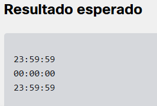
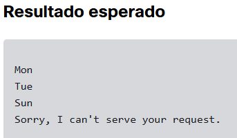

# python_labs
## 1 - Class_Timer

Instruções do exercicio:
Precisamos que a classe seja capaz de contar segundos. Simples? Nem tanto quanto você imagina, pois temos alguns requisitos específicos.

Leia com atenção, uma vez que a classe que está prestes a criar será usada para lançar foguetes levando missões internacionais para Marte. É uma enorme responsabilidade. Contamos com você!

Sua classe será chamada Timer. Seu construtor aceita três argumentos representando horas (um valor no intervalo [0..23], usaremos o sistema de 24 horas), minutos (no intervalo [0..59]) e segundos (intervalo [0..59]).

Zero é o valor padrão para todos os parâmetros acima. Não há necessidade de se realizar verificações de validação.

A própria classe deve oferecer os seguintes recursos:

objetos da classe devem ser "imprimíveis", ou seja, devem ser capazes de converter a si mesmos de maneira implícita em strings no seguinte formato: "hh:mm:ss", com zeros à esquerda incluídos quando qualquer um dos valores for menor de 10;
a classe deve ser equipada com métodos sem parâmetro chamado next_second() e previous_second(), incrementando o tempo armazenado dentro dos objetos por +1/-1 segundo, respectivamente.
Use as seguintes dicas:

* todas as propriedades do objeto devem ser privadas;
* recomendamos escrever uma função separada (e não um método!) para formatar a string de hora.

## 2 - Weeker

Instruções do exercicio:

Sua tarefa é implementar uma classe chamada Weeker. Não, seus olhos não estão lhe enganando, a origem deste nome é o fato dos objetos dessa classe serem capazes de armazenar e manipular os dias da semana (ou days of the week, em inglês).

O construtor da classe aceita um argumento: uma string. A string representa o nome do dia da semana, em inglês, e os únicos valores aceitáveis devem vir do seguinte grupo:

Mon Tue Wed Thu Fri Sat Sun

Chamar o construtor com um argumento que não esteja presente nesse grupo irá gerar a exceção WeekDayError. A classe deve fornecer os seguintes recursos:

* objetos da classe devem ser "imprimíveis", ou seja, devem ser capazes de converter a si mesmos de maneira implícita em strings no mesmo formato dos argumentos do construtor;
* a classe deve ser equipada com métodos de um parâmetro, chamados add_days(n) e subtract_days(n), sendo n um número inteiro que atualiza o dia da semana armazenado dentro do objeto, refletindo a mudança da data pelo número de dias indicado, seja a mais ou a menos.
* todas as propriedades do objeto devem ser privadas;

